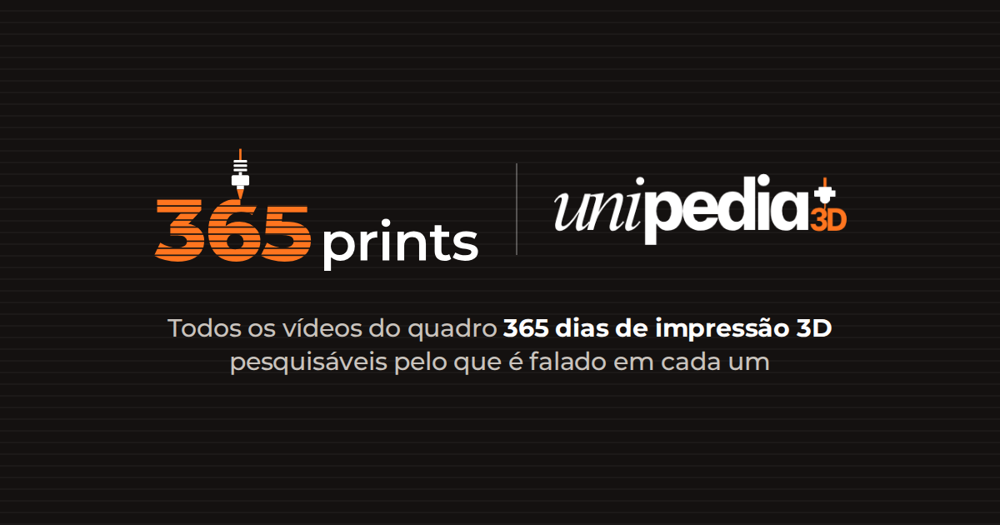

# 365prints



Índice pesquisável dos vídeos do quadro "365 dias de impressão 3D" do [@unipedia3d](https://www.instagram.com/unipedia3d/). Projeto de fã, sem fins lucrativos: o site mostra título, resumo, transcrição e links; os vídeos continuam no TikTok e no Instagram.

**Site:** https://365prints.vercel.app

## Como funciona

- **Página inicial:** uma impressora 3D em three.js imprime o "365" camada por camada até o dia atual (dá para arrastar a linha do tempo e voltar a qualquer dia), e um calendário mostra os 365 dias do quadro.
- **Busca pelo que é falado:** cada vídeo é transcrito localmente com Whisper, e a busca (no navegador, com MiniSearch) procura no título, nas tags, na legenda e na fala, aceitando erros de digitação. O resultado mostra o trecho em que o assunto aparece.
- **TikTok + Instagram juntos:** o pipeline coleta as duas redes e junta o mesmo vídeo pelo número do dia e pela legenda. Uma checagem compara o dia falado no vídeo com a legenda para pegar números errados.
- **Descrições:** título, resumo, categoria e palavras-chave escritos a partir da transcrição, em lotes revisáveis (`pipeline/data/enriched/`).
- **Métricas:** eventos anônimos no PostHog (buscas, buscas sem resultado, vídeos abertos, cliques por rede) e um painel `/admin` protegido por senha.

**Stack:** Next.js 16 · React 19 · TypeScript · Tailwind CSS 4 · three.js · Python · yt-dlp · instaloader · faster-whisper · PostHog · Vercel

- `web/`: o site (Next.js). É a única parte que vai para a Vercel.
- `pipeline/`: scripts que rodam no seu computador para coletar, transcrever e gerar os dados do site.

## Publicar (primeira vez)

1. **GitHub:** envie este projeto para um repositório (`git push`).
2. **PostHog** (grátis, posthog.com): crie a conta e o projeto e anote:
   - a chave do projeto (`phc_…`), em *Settings → Project → Project API key*;
   - o ID do projeto (o número na URL, `/project/12345`);
   - uma chave pessoal com permissão só de **Query: Read**, em *Settings → Personal API keys*;
   - em *Settings → Project → Timezone*, escolha **America/Sao_Paulo**.
3. **Vercel** (grátis, vercel.com, entrar com o GitHub): *Add New → Project*, importe o repositório e, em **Root Directory**, escolha `web`.
4. Em *Settings → Environment Variables* da Vercel, cadastre as variáveis de [`web/.env.example`](web/.env.example).
5. Faça o deploy. Depois, coloque o endereço final em `NEXT_PUBLIC_SITE_URL` e faça **Redeploy**: variáveis `NEXT_PUBLIC_*` só valem depois de um novo build.

O painel fica em `/admin` (senha em `ADMIN_PASSWORD`). O site é indexado pelo Google (menos o `/admin`); para acompanhar no [Search Console](https://search.google.com/search-console), cadastre o código da "tag HTML" em `GOOGLE_SITE_VERIFICATION`, faça Redeploy e envie `/sitemap.xml`.

## Atualizar com vídeos novos

```bash
cd pipeline
uv run collect_tiktok.py
uv run collect_instagram.py CONTA_SECUNDARIA
uv run transcribe.py
uv run enrich_queue.py   # mostra o que falta descrever (o Claude escreve os lotes)
uv run build.py
cd ..
git add -A && git commit -m "Atualiza vídeos" && git push   # a Vercel publica sozinha
```

Detalhes do pipeline e do formato das descrições: [CLAUDE.md](CLAUDE.md).
